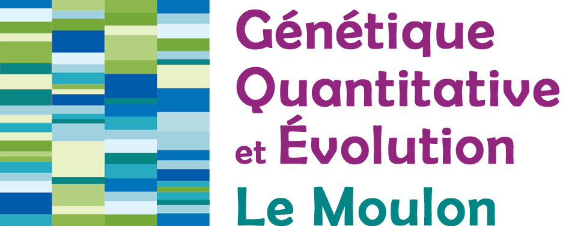

# Dossier de partage du WP3 du projet Stat4Plant 

 

 &nbsp;

## Structure des dossier

- meeting : tout les ordres du jours et rapport rendu pour certaines réunions ou semaines

------------------------------------------------------------------------
